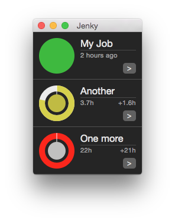

Jenky
=====
Jenkins n' stuff!

What it looks like so far:

Using it!
---------
Clicking on a job name will open the job page in a browser, while the **>** button in the corner will link to the console output.
Clicking anywhere else besides the status circle will force refresh the job.

Configuring jobs must be manually done in _cc.Jenky.plist_ for now.

Known Issues
------------
- Only a single server is supported
- Jobs refresh synchronously which leads to strange behavior when connection is spotty
- Code doesn't follow MVC very faithfully, and could use some cleanup.

#####Visual
- When the window is only a bit larger than minimum width (just status dots), the interface cannot fit usefully. Maybe width snapping like the iTunes mini-player is viable.
- Job name is clipped instead of truncated with an ellipsis due to being a button.
- Scrollbar changes the color of elements it overlaps, probably due to vibrancy/transparency.
